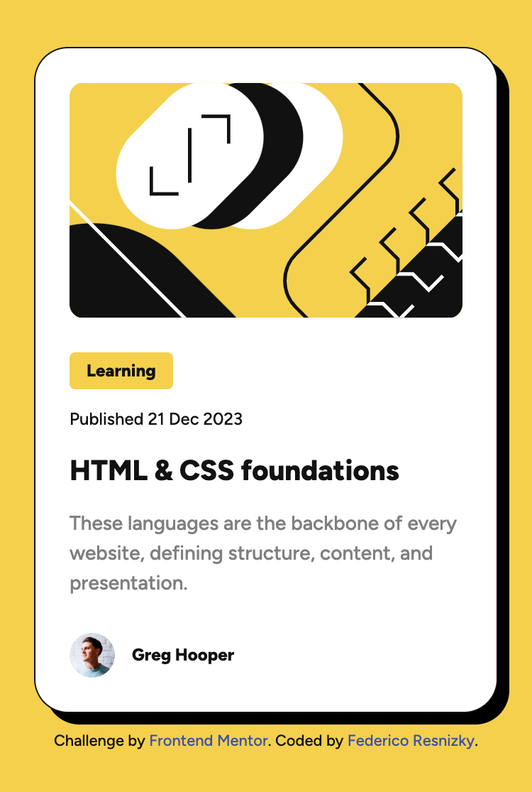
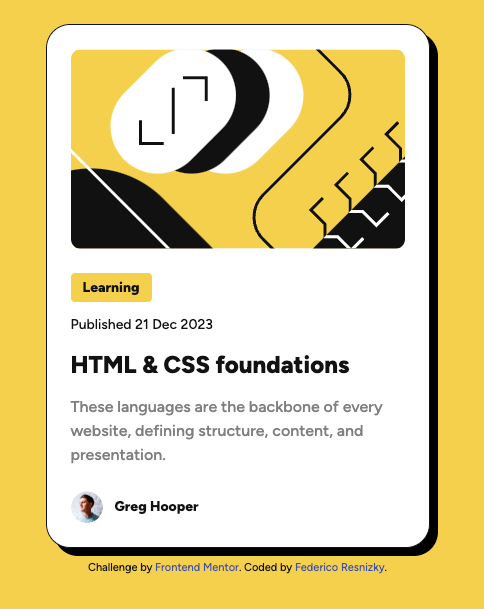
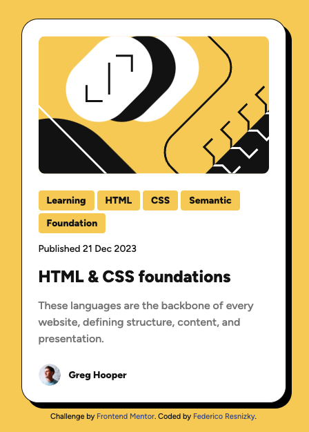

# Frontend Mentor - Blog preview card solution

This is a solution to the [Blog preview card challenge on Frontend Mentor](https://www.frontendmentor.io/challenges/blog-preview-card-ckPaj01IcS). Frontend Mentor challenges help you improve your coding skills by building realistic projects.

## Table of contents

- [Overview](#overview)
  - [The challenge](#the-challenge)
  - [Screenshot](#screenshot)
  - [Links](#links)
- [My process](#my-process)
  - [Built with](#built-with)
  - [What I learned](#what-i-learned)
  - [Useful resources](#useful-resources)
- [Author](#author)

## Overview

### The challenge

Users should be able to:

- See hover and focus states for all interactive elements on the page

### Screenshot

#### Desktop



#### Mobile



### Links

- Solution URL: [GitHub](https://github.com/fresnizky/blog-preview-card)
- Live Site URL: [Live Site](https://fresnizky.github.io/blog-preview-card/)

## My process

### Built with

- Semantic HTML5 markup
- Tailwind
- Flexbox
- CSS Grid

### What I learned

I started adding Tailwind to the project, and configured the colors and fonts provided in the [Style Guide](./style-guide.md).

Then, I created the layout using generic tags like `div` and `span` with class names, and used ChatGPT to get suggestions of semantic HTML tags to use. With a few tweaks I got the final HTML layout for the challenge.

I adapted the **Learning** label to be a tag list of possible topics for the blog post, so I used an `ul` with `flow` and `wrap`. You can check it out uncommenting the extra `li` in [index.html](index.html)



This challenge has this following extra challenge:

> The font sizes in this project a slightly smaller in the mobile layout. Find a way to reduce font size for smaller screens without using media queries.

After some research I found the CSS `clamp()` function which is used for Fluid Typography. It can be used for most of the places where you can specify some kind of size. This is the syntax:

```css
.style {
  font-size: clamp(min, ideal, max);
}
```

The `clamp()` function uses the ideal value to calculate the size, so it should be a relative value such as `vw`, `vh`, `rem`, `%`, etc. If the calculated value is less than the `min` value, it will use the `min` value. Similarly, if the calculated value is greater than the `max` value, it will use the `max` value. Therefore, both `min` and `max` should be absolute values.

Let's take a look at an example from the solution:

```css
.lg {
  font-size: clamp(1.25rem, 5vw, 1.5rem);
}
```

This is used for the heading, it will have a size of `5vw`, but it won't resize below `20px` or greater than `24px`.

### Useful resources

- [MDN](https://developer.mozilla.org/en-US/docs/Web/CSS/clamp) - MDN article with the documentation of `clamp()`.
- [Web.dev](https://web.dev/articles/min-max-clamp) - Web.dev article explaining how `min()`, `max()` and `clamp()` functions work with some helpful examples

## Author

- Frontend Mentor - [@fresnizky](https://www.frontendmentor.io/profile/fresnizky)
- Twitter - [@fedearg79](https://www.twitter.com/fedearg79)
